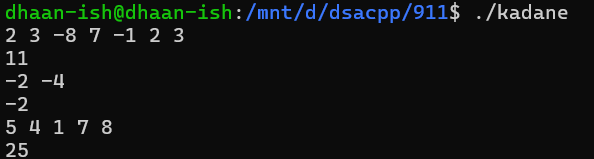

# DSA Question - 09/11/2024

### 1. Maximum Subarray - Kadane’s Algorithm

Given an array arr[], the task is to find the subarray that has the maximum sum and return its sum.
Input: arr[] = {2, 3, -8, 7, -1, 2, 3}
Output: 11
Explanation: The subarray {7, -1, 2, 3} has the largest sum 11.
Input: arr[] = {-2, -4}
Output: –2
Explanation: The subarray {-2} has the largest sum -2.
Input: arr[] = {5, 4, 1, 7, 8}
Output: 25
Explanation: The subarray {5, 4, 1, 7, 8} has the largest sum 25.

```cpp
#include <iostream>
#include <vector>

using namespace std;

int findMaxSubarray(vector<int> lst){
	int maxi = lst[0];
	int res = lst[0];

	for (int i = 1; i < lst.size(); i++){
		maxi = max(lst[i], maxi + lst[i]);
		res = max(maxi, res);
	}

	for (int ls : lst){
		cout << ls << " ";
	}
	cout << endl;
	return res;
}

int main(){
	vector<vector<int>> lst = {{2, 3, -8, 7, -1, 2, 3}, {-2, -4}, {5, 4, 1, 7, 8}};
	for (auto ls : lst){
		cout << findMaxSubarray(ls) << endl;
	}
}
```



### Time Complexity

O(n)

### 2. Maximum Product Subarray

Given an integer array, the task is to find the maximum product of any subarray.
Input: arr[] = {-2, 6, -3, -10, 0, 2}
Output: 180
Explanation: The subarray with maximum product is {6, -3, -10} with product = 6 * (-3) * (-10) = 180
Input: arr[] = {-1, -3, -10, 0, 60}
Output: 60
Explanation: The subarray with maximum product is {60}.

```cpp
#include <iostream>
#include <vector>

using namespace std;

int findMaxPro(vector<int> lst){
	int res = lst[0];
	int maxi = lst[0];
	int mini = lst[0];

	for (int i = 1; i < lst.size(); i++){
		if (lst[i] < 0){
			int temp = maxi;
			maxi = mini;
			mini = temp;
		}

		maxi = max(lst[i], maxi * lst[i]);
		mini = min(lst[i], mini * lst[i]);
		res = max(res, maxi);
	}
	for (int i : lst){
		cout << i << " ";
	}
	cout << endl;
	return res;
}

int main(){
	vector<vector<int>> lst = {{-2, 6, -3, -10, 0, 2}, {-1, -3, -10, 0, 60}};
	for (auto ls : lst){
		cout << findMaxPro(ls) << endl;
	}
}

```


### Time Complexity

O(n)

### 3. Search in sorted and rotated array

Search in a sorted and rotated Array
Given a sorted and rotated array arr[] of n distinct elements, the task is to find the index of given key in the array. If the key is not present in the array, return -1.
Input : arr[] = {4, 5, 6, 7, 0, 1, 2}, key = 0
Output : 4
Input : arr[] = { 4, 5, 6, 7, 0, 1, 2 }, key = 3
Output : -1
Input : arr[] = {50, 10, 20, 30, 40}, key = 10
Output : 1

```cpp
#include <iostream>
#include <vector>

using namespace std;

int rotsearch(vector<int> lst, int target){
	int left = 0;
	int right = lst.size() - 1;
	int mid;
		
	for (int ls : lst){
		cout << ls << " ";
	}
	cout << endl;
	
	while (left <= right){
		mid = (left + right) / 2;

		if (lst[mid] == target){
			return mid;
		}

		if (lst[left] <= lst[mid]){
			if (target < lst[mid] && lst[left] <= target){
				right = mid - 1;
			}else{
				left = mid + 1;
			}
		}else{
			if (target > lst[mid] && target <= lst[right]){
				left = mid + 1;
			}else{
				right = mid - 1;
			}
		}
	}
	return -1;

}

int main(){
	vector<vector<int>> lst = {{4, 5, 6, 7, 0, 1, 2}, 
														 { 4, 5, 6, 7, 0, 1, 2 }, 
														 {50, 10, 20, 30, 40}};
	vector<int> targets = {0, 3, 10};

	for (int i = 0; i < targets.size(); i++){
		cout << rotsearch(lst[i], targets[i]) << endl;
	}
}
```


### Time Complexity

O(n log n)

### 4. Container with most water


Input: arr = [1, 5, 4, 3]
Output: 6
Explanation:
5 and 3 are distance 2 apart. So the size of the base = 2.
Height of container = min(5, 3) = 3. So total area = 3 * 2 = 6
Input: arr = [3, 1, 2, 4, 5]
Output: 12
Explanation:
5 and 3 are distance 4 apart. So the size of the base = 4.
Height of container = min(5, 3) = 3. So total area = 4 * 3 = 12

```cpp
#include <iostream>
#include <vector>

using namespace std;

int findMaxWater(vector<int> container){
	int left = 0;
	int right = container.size() - 1;
	int maxi = 0;
	int cur;

	for (int h : container){
		cout << h << " ";
	}

	cout << endl;

	while(left < right){
		cur = min(container[left], container[right]) * (right - left);
		maxi = max(cur, maxi);

		if (container[left] < container[right]){
			left++;
		}else{
			right--;
		}
	}
	return maxi;
}

int main(){
	vector<vector<int>> containers = {{1, 5, 4, 3}, {3, 1, 2, 4, 5}};
	for (auto container : containers){
		cout << findMaxWater(container) << endl;
	}
}
```


### Time Complexity

O(n)

### 5. Factorial of Large Number

Input: 100
Output: 93326215443944152681699238856266700490715968264381621468592963895217599993229915608941463976156518286253697920827223758251185210916864000000000000000000000000
Input: 50
Output: 30414093201713378043612608166064768844377641568960512000000000000

```java
import java.math.BigInteger;

public class Factorial {
    static BigInteger fact(int n) {
        BigInteger res = BigInteger.ONE;
        for (int i = 1; i <= n; i++) {
            res = res.multiply(BigInteger.valueOf(i));
        }

        return res;
    }

    public static void main(String[] args) {
        System.out.println(fact(100));
        System.out.println(fact(50));
    }
}
```


### Time Complexity

O(n)

### 6. Trapping Rainwater

Trapping Rainwater Problem states that given an array of n non-negative integers arr[] representing an elevation map where the width of each bar is 1, compute how much water it can trap after rain.
Input: arr[] = {3, 0, 1, 0, 4, 0, 2}
Output: 10
Explanation: The expected rainwater to be trapped is shown in the above image.
Input: arr[] = {3, 0, 2, 0, 4}
Output: 7
Explanation: We trap 0 + 3 + 1 + 3 + 0 = 7 units.
Input: arr[] = {1, 2, 3, 4}
Output: 0
Explanation : We cannot trap water as there is no height bound on both sides
Input: arr[] = {10, 9, 0, 5}
Output: 5
Explanation : We trap 0 + 0 + 5 + 0 = 5

```cpp
#include <iostream>
#include <vector>

using namespace std;

int findWater(vector<int> ele){
	int left = 0;
	int right = ele.size() - 1;
	int leftmax = 0;
	int rightmax = 0;
	int res = 0;

	while (left < right){
		if (ele[left] < ele[right]){
			if (ele[left] >= leftmax){
				leftmax = ele[left];
			}else{
				res += leftmax - ele[left];
			}
			left++;
		}else{
			if (ele[right] >= rightmax){
				rightmax = ele[right];
			}else{
				res += rightmax - ele[right];
			}
			right--;
		}
	}
	return res;
}

int main(){
	vector<vector<int>> elevations = {{3, 0, 1, 0, 4, 0, 2}, 
																		{3, 0, 2, 0, 4}, 
																		{1, 2, 3, 4}, 
																		{10, 9, 0, 5}};
	for (auto elevation : elevations){
		cout << findWater(elevation) << endl;
	}
}
```


### Time Complexity

O(n)

### 7. Chocolate Distribution

Given an array arr[] of n integers where arr[i] represents the number of chocolates in ith packet. Each packet can have a variable number of chocolates. There are m students, the task is to distribute chocolate packets such that:
Each student gets exactly one packet.
The difference between the maximum and minimum number of chocolates in the packets given to the students is minimized.
Input: arr[] = {7, 3, 2, 4, 9, 12, 56}, m = 3
Output: 2
Explanation: If we distribute chocolate packets {3, 2, 4}, we will get the minimum difference, that is 2.
Input: arr[] = {7, 3, 2, 4, 9, 12, 56}, m = 5
Output: 7
Explanation: If we distribute chocolate packets {3, 2, 4, 9, 7}, we will get the minimum difference, that is 9 – 2 = 7.

```cpp
#include <iostream>
#include <vector>
#include <algorithm>
#include <climits>

using namespace std;

int findMinDif(vector<int> chocos, int st){
	sort(chocos.begin(), chocos.end());
	int mini = INT_MAX;
	int cur;

	for (int i = 0; i < chocos.size() - st; i++){
		cur = chocos[i + st - 1] - chocos[i];
		mini = min(cur, mini);
	}
	return mini;
}

int main(){
	vector<vector<int>> chocos = {{7, 3, 2, 4, 9, 12, 56}, 
																{7, 3, 2, 4, 9, 12, 56}};
	vector<int> st = {3, 5};

	for (int i = 0; i < st.size(); i++){
		cout << findMinDif(chocos[i], st[i]) << endl;
	}
}
```


### Time Complexity

O(n)

### 8. Merge Intervals

Merge Overlapping Intervals
Given an array of time intervals where arr[i] = [starti, endi], the task is to merge all the overlapping intervals into one and output the result which should have only mutually exclusive intervals.
Input: arr[] = [[1, 3], [2, 4], [6, 8], [9, 10]]
Output: [[1, 4], [6, 8], [9, 10]]
Explanation: In the given intervals, we have only two overlapping intervals [1, 3] and [2, 4]. Therefore, we will merge these two and return [[1, 4}], [6, 8], [9, 10]].
Input: arr[] = [[7, 8], [1, 5], [2, 4], [4, 6]]
Output: [[1, 6], [7, 8]]
Explanation: We will merge the overlapping intervals [[1, 5], [2, 4], [4, 6]] into a single interval [1, 6].

```cpp
#include <iostream>
#include <vector>
#include <algorithm>

using namespace std;

vector<vector<int>> merge(vector<vector<int>> interval){
	sort(interval.begin(), interval.end());
	int start = interval[0][0];
	int end = interval[0][1];

	vector<vector<int>> res;

	for (int i = 1; i < interval.size(); i++){
		if (interval[i][0] <= end){
			end = max(end, interval[i][1]);
		}else{
			res.push_back({start, end});
			start = interval[i][0];
			end = interval[i][1];
		}
	}
	res.push_back({start, end});
	return res;
}

int main(){
	vector<vector<vector<int>>> intervals = {{{7, 8}, {1, 5}, {2, 4}, {4, 6}}, {{1, 3}, {2, 4}, {6, 8}, {9, 10}}};
	vector<vector<int>> res;
	for (auto interval : intervals) {
        res = merge(interval);
        
        for (auto re : res) {
            cout << "[" << re[0] << ", " << re[1] << "] ";
        }
        cout << endl;
    }
}
```


### Time Complexity

O(n) [n - number of intervaks]

### 9. Boolean Matrix

Given a boolean matrix mat[M][N] of size M X N, modify it such that if a matrix cell mat[i][j] is 1 (or true) then make all the cells of ith row and jth column as 1.
Input: {{1, 0},
{0, 0}}
Output: {{1, 1}
{1, 0}}
Input: {{0, 0, 0},
{0, 0, 1}}
Output: {{0, 0, 1},
{1, 1, 1}}
Input: {{1, 0, 0, 1},
{0, 0, 1, 0},
{0, 0, 0, 0}}
Output: {{1, 1, 1, 1},
{1, 1, 1, 1},
{1, 0, 1, 1}}

```cpp
#include <vector>
#include <iostream>

using namespace std;

void processMatrix(const vector<vector<int>>& mat) {
    int n = mat.size();
    int m = mat[0].size();
    vector<vector<int>> res(n, vector<int>(m, 0));

    for (int i = 0; i < n; i++) {
        for (int j = 0; j < m; j++) {
            if (mat[i][j] == 1) {
                for (int k = 0; k < m; k++) {
                    res[i][k] = 1;
                }
                for (int k = 0; k < n; k++) {
                    res[k][j] = 1;
                }
            }
        }
    }

    for (int i = 0; i < n; i++) {
        for (int j = 0; j < m; j++) {
            cout << res[i][j] << " "; 
        }
        cout << endl;
    }
    cout << endl;
}

int main() {
    vector<vector<vector<int>>> mats = {
        {{1, 0}, {0, 0}},
        {{0, 0, 0}, {0, 0, 1}},
        {{1, 0, 0, 1}, {0, 0, 1, 0}, {0, 0, 0, 0}}
    };

    for (auto mat : mats) {
        processMatrix(mat);
    }

    return 0;
}

```


### Time Complexity

O(m * n)

### 10. Print a given matrix in spiral for

Given an m x n matrix, the task is to print all elements of the matrix in spiral form.
Input: matrix = {{1, 2, 3, 4},
{5, 6, 7, 8},
{9, 10, 11, 12},
{13, 14, 15, 16 }}
Output: 1 2 3 4 8 12 16 15 14 13 9 5 6 7 11 10
Input: matrix = { {1, 2, 3, 4, 5, 6},
{7, 8, 9, 10, 11, 12},
{13, 14, 15, 16, 17, 18}}
Output: 1 2 3 4 5 6 12 18 17 16 15 14 13 7 8 9 10 11
Explanation: The output is matrix in spiral format.

```cpp
#include <iostream>
#include <vector>

using namespace std;

void printspiral(vector<vector<int>>& mat, int n, int m) {
    int top = 0;
    int bottom = n - 1;
    int left = 0;
    int right = m - 1;

    while (top <= bottom && left <= right) {
        for (int i = left; i <= right; i++) {
            cout << mat[top][i] << " ";
        }
        top++;

        for (int i = top; i <= bottom; i++) {
            cout << mat[i][right] << " ";
        }
        right--;

        if (top <= bottom) {
            for (int i = right; i >= left; i--) {
                cout << mat[bottom][i] << " ";
            }
            bottom--;
        }

        if (left <= right) {
            for (int i = bottom; i >= top; i--) {
                cout << mat[i][left] << " ";
            }
            left++;
        }
    }
}

int main() {
    vector<vector<int>> mat = {{1, 2, 3, 4}, {5, 6, 7, 8}, {9, 10, 11, 12}, {13, 14, 15, 16}};
    vector<vector<int>> mat1 = {{1, 2, 3, 4, 5, 6}, {7, 8, 9, 10, 11, 12}, {13, 14, 15, 16, 17, 18}};
    printspiral(mat, mat.size(), mat[0].size());
    cout << endl;
    printspiral(mat1, mat1.size(), mat1[0].size());
    return 0;
}

```


### Time Complexity

O(n * m)

### 11.

```cpp
#
```

### Time Complexity

### 12.

```cpp
#
```

### Time Complexity

### 13. Balanced Paranthesis

Check if given Parentheses expression is balanced or not
Given a string str of length N, consisting of „(„ and „)„ only, the task is to check whether it is balanced or not.
Input: str = “((()))()()”
Output: Balanced
Input: str = “())((())”
Output: Not Balanced

```cpp
#include <iostream>
#include <vector>
#include <string>
#include <stack>

using namespace std;

bool isbalanced(string s){
	stack<char> st;
	st.push(s[0]);
	int i = 1;

	while (i < s.size()){
		if (s[i] == '('){
			st.push(s[i]);
		}else{
			if (st.empty() || st.top() != '(') {
                return false; 
            }
            st.pop();
		}
		i++;
	}
	return true;
}

int main(){
	vector<string> tc = {"((()))()()", "())((())"};
	for (string t : tc){
		if (isbalanced(t)){
			cout << "Balanced" << endl;
		}else{
			cout << "Not Balanced" << endl;
		}
	}
}
```


### Time Complexity

O(n)

### 14. Anagram or not

Given two strings s1 and s2 consisting of lowercase characters, the task is to check whether the two given strings are anagrams of each other or not. An anagram of a string is another string that contains the same characters, only the order of characters can be different.
Input: s1 = “geeks” s2 = “kseeg”
Output: true
Explanation: Both the string have same characters with same frequency. So, they are anagrams.
Input: s1 = “allergy” s2 = “allergic”
Output: false
Explanation: Characters in both the strings are not same. s1 has extra character „y‟ and s2 has extra characters „i‟ and „c‟, so they are not anagrams.
Input: s1 = “g”, s2 = “g”
Output: true
Explanation: Characters in both the strings are same, so they are anagrams.

```cpp

#include <iostream>
#include <string>
#include <algorithm>
#include <vector>

using namespace std;

bool checkanagram(string s1, string s2){
	int n = s1.size();
	int m = s2.size();

	if (n != m){
		return false;
	}

	sort(s1.begin(), s1.end());
	sort(s2.begin(), s2.end());

	for (int i = 0; i < n; i++){
		if (s1[i] != s2[i]){
			return false;
		}
	}
	return true;
}

int main(){
	vector<vector<string>> arrs = {
        {"geeks", "kseeg"},
        {"allergy", "allergic"},
        {"g", "g"},
        {"ok", "ko"},
    };

	for (auto arr : arrs){
		if (checkanagram(arr[0], arr[1])){
		cout << "true" << endl;
		}else{
			cout << "false" << endl;
		}
	}
}

```


### Time Complexity

O(n log n)

### 15.  Longest Palindrome

Longest Palindromic Substring
Given a string str, the task is to find the longest substring which is a palindrome. If there are multiple answers, then return the first appearing substring.
Input: str = “forgeeksskeegfor”
Output: “geeksskeeg”
Explanation: There are several possible palindromic substrings like “kssk”, “ss”, “eeksskee” etc. But the substring “geeksskeeg” is the longest among all.
Input: str = “Geeks”
Output: “ee”
Input: str = “abc”
Output: “a”
Input: str = “”
Output: “”

```cpp
#include <iostream>
#include <string>
#include <vector>

using namespace std;

string getpal(const string &s, int left, int right) {
    while (left >= 0 && right < s.size() && s[left] == s[right]) {
        left--;  
        right++;
    }
    return s.substr(left + 1, right - left - 1);
}

int main() {
    vector<string> st = {"forgeeksskeegfor", "Geeks", "abc", ""};
    for (string s : st){
        string large;

        for (int i = 0; i < s.size(); i++) {
            string s1 = getpal(s, i, i);
            string s2 = getpal(s, i, i + 1);
            if (s1.size() > large.size()) {
                large = s1;
            }
            if (s2.size() > large.size()) {
                large = s2;
            }
        }
        cout << large << endl; 
    }   

}

```


### Time Complexity

O(n^2)

### 16. Longest Common Prefix

Longest Common Prefix using Sorting
Given an array of strings arr[]. The task is to return the longest common prefix among each and every strings present in the array. If there‟s no prefix common in all the strings, return “-1”.
Input: arr[] = [“geeksforgeeks”, “geeks”, “geek”, “geezer”]
Output: gee
Explanation: “gee” is the longest common prefix in all the given strings.
Input: arr[] = [“hello”, “world”]
Output: -1
Explanation: There‟s no common prefix in the given strings.

```cpp
#include <iostream>
#include <string>
#include <vector>
#include <algorithm>

using namespace std;

string findcommon(vector<string> arr){
	sort(arr.begin(), arr.end());

	string first = arr[0];
	string last = arr[arr.size() - 1];
	string cp = "";
	int n = min(first.size(), last.size());

	for (int i = 0; i < n; i++){
		if (first[i] == last[i]){
			cp += first[i];
		}else{
			break;
		}
	}
	if (cp.empty()){
		return "-1";
	}else{
		return cp;
	}
}

int main(){
	vector<vector<string>> arrs = {{"geeksforgeeks", "geeks", "geek", "geezer"}, {"hello", "world"}};
	string res;

	for (auto arr : arrs){
		res = findcommon(arr);
		cout << res << endl;
	}
}
```


### Time Complexity

O(n log n)

### 17. Delete Middle Element in Stack

Given a stack with push(), pop(), and empty() operations, The task is to delete the middle element of it without using any additional data structure.
Input : Stack[] = [1, 2, 3, 4, 5]
Output : Stack[] = [1, 2, 4, 5]
Input : Stack[] = [1, 2, 3, 4, 5, 6]
Output : Stack[] = [1, 2, 4, 5, 6]

```cpp
#include <iostream>
#include <stack>

using namespace std;

void deletemid(stack<int>& st, int size, int curr = 0){
	if (curr == size / 2){
		st.pop();
		return;
	}

	int temp = st.top();
	st.pop();

	deletemid(st, size, curr + 1);

	st.push(temp);
}

void deletes(stack<int>& st){
	deletemid(st, st.size());
}

int main(){
	stack<int> st;
	stack<int> st1;

	st.push(1);
	st.push(2);
	st.push(3);
	st.push(4);
	st.push(5);

	st1.push(1);
	st1.push(2);
	st1.push(3);
	st1.push(4);
	st1.push(5);
	st1.push(6);

	deletes(st);
	deletes(st1);

	while (!st.empty()){
		cout << st.top() << " ";
		st.pop();
	}
	cout << endl;
	while (!st1.empty()){
		cout << st1.top() << " ";
		st1.pop();
	}
	cout << endl;
	return 0;
}

```


### Time Complexity

O(n)

### 18. Next Greater Element

Next Greater Element (NGE) for every element in given Array
Given an array, print the Next Greater Element (NGE) for every element.
Note: The Next greater Element for an element x is the first greater element on the right side of x in the array. Elements for which no greater element exist, consider the next greater element as -1.
Input: arr[] = [ 4 , 5 , 2 , 25 ]
Output: 4 –> 5
5 –> 25
2 –> 25
25 –> -1
Explanation: Except 25 every element has an element greater than them present on the right side
Input: arr[] = [ 13 , 7, 6 , 12 ]
Output: 13 –> -1
7 –> 12
6 –> 12
12 –> -1
Explanation: 13 and 12 don‟t have any element greater than them present on the right side

```cpp
#include <iostream>
#include <vector>

using namespace std;

vector<int> findnextlarge(vector<int> arr){
	int n = arr.size();
	vector<int> res(n);

	for (int i = 0; i < n; i++){
		int curmax = arr[i];
		for (int j = i + 1; j < n; j++){
			curmax = max(curmax, arr[j]);
			if (curmax != arr[i]){
				break;
			}
		}
		if (curmax != arr[i]){
			res[i] = curmax;
		}else{
			res[i] = -1;
		}
	}

	return res;
}

int main(){
	vector<vector<int>> arrs = {{4 , 5 , 2 , 25}, {13 , 7, 6 , 12}};
	vector<int> res;

	for (auto arr : arrs){
		res = findnextlarge(arr);
		for (int i = 0; i < arr.size(); i++){
			cout << arr[i] << "->" << res[i] << endl;
		}
		cout << endl;
	}
}

```


### Time Complexity

O(n ^ 2)

### 19. Right View of Binary Tree

Given a Binary Tree, the task is to print the Right view of it. The right view of a Binary Tree is a set of rightmost nodes for every level.


```cpp
#include <queue>
#include <iostream>

using namespace std;

struct Node {
    int data;
    Node* left;
    Node* right;

    Node(int val) : data(val), left(nullptr), right(nullptr) {}
};

class BinaryTree {
public:
    Node* root;

    void printright() {

        queue<Node*> q;
        q.push(root);

        while (!q.empty()) {
            int n = q.size(); 

            for (int i = 0; i < n; i++) {
                Node* cur = q.front();
                q.pop();
                if (i == n - 1) {
                    cout << cur->data << " ";
                }
                if (cur->left != nullptr) {
                    q.push(cur->left);
                }
                if (cur->right != nullptr) {
                    q.push(cur->right);
                }
            }
        }
    }
};

int main() {
    BinaryTree t;

    t.root = new Node(1);
    t.root->left = new Node(2);
    t.root->right = new Node(3);
    t.root->left->left = new Node(4);
    t.root->left->left->right = new Node(5);

    t.printright(); 

    cout << endl;
    
    BinaryTree t1;

    t1.root = new Node(1);
    t1.root->left = new Node(2);
    t1.root->right = new Node(3);
    t1.root->right->left = new Node(4);
    t1.root->right->right = new Node(5);

    t1.printright();

    return 0;
}
```


### Time Complexity

O(n)

### 20. Height of a Binary Tree

Given a binary tree, the task is to find the maximum depth or height of the tree. The height of the tree is the number of vertices in the tree from the root to the deepest node.


```cpp
#include <queue>
#include <iostream>

using namespace std;

struct Node{
    int data;
    Node* left;
    Node* right;

    Node(int val) : data(val), left(nullptr), right(nullptr) {}
};

class BinaryTree{
public:
    Node* root;

    BinaryTree() : root(nullptr) {}

    int findHeight(){
        queue<Node*> q;

        q.push(root);
        int height = 0;

        while(!q.empty()){
            int n = q.size();

            for (int i = 0; i < n; i++){
                Node* cur = q.front();
                q.pop();

                if (cur -> left != nullptr){
                    q.push(cur -> left);
                }
                if (cur -> right != nullptr){
                    q.push(cur -> right);
                }
            }
            height++;
        }
        return height;
    }  
};

int main(){
    BinaryTree t;

    t.root = new Node(12);
    t.root->left = new Node(8);
    t.root->right = new Node(18);
    t.root->left->left = new Node(5);
    t.root->left->right = new Node(11);

    cout << t.findHeight() << endl;

    BinaryTree t1;

    t1.root = new Node(1);
    t1.root->left = new Node(2);
    t1.root->right = new Node(3);
    t1.root->left->left = new Node(4);
    t1.root->right->right = new Node(5);
    t1.root->right->right->left = new Node(6);
    t1.root->right->right->right = new Node(7);

    cout << t1.findHeight();
}
```


### Time Complexity

O(n)