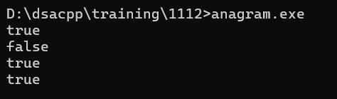

# DSA Question - 12/11/2024

### 1. Anagram

Given two strings **s1** and **s2** consisting of **lowercase** characters, the task is to check whether the two given strings are **anagrams** of each other or not. An anagram of a string is another string that contains the same characters, only the order of characters can be different.

**Examples:**

> Input: s1 = “geeks”  s2 = “kseeg”Output: trueExplanation: Both the string have same characters with same frequency. So, they are anagrams.Input: s1 = “allergy”  s2 = “allergic”Output: falseExplanation: Characters in both the strings are not same. s1 has extra character ‘y’ and s2 has extra characters ‘i’ and ‘c’, so they are not anagrams.Input: s1 = “g”, s2 = “g”Output: trueExplanation: Characters in both the strings are same, so they are anagrams.
> 

```jsx

#include <iostream>
#include <string>
#include <algorithm>
#include <vector>

using namespace std;

bool checkanagram(string s1, string s2){
	int n = s1.size();
	int m = s2.size();

	if (n != m){
		return false;
	}

	sort(s1.begin(), s1.end());
	sort(s2.begin(), s2.end());

	for (int i = 0; i < n; i++){
		if (s1[i] != s2[i]){
			return false;
		}
	}
	return true;
}

int main(){
	vector<vector<string>> arrs = {
        {"geeks", "kseeg"},
        {"allergy", "allergic"},
        {"g", "g"},
        {"ok", "ko"},
    };

	for (auto arr : arrs){
		if (checkanagram(arr[0], arr[1])){
		cout << "true" << endl;
		}else{
			cout << "false" << endl;
		}
	}
}
```



### Time Complexity

O(n log n)

### 2. Row with max 1

Given a **binary** 2D array, where each row is **sorted**. Find the row with the maximum number of 1s.

**Examples:**

> Input matrix : 0 1 1 1                        0 0 1 1                        1 1 1 1                         0 0 0 0Output: 2Explanation: Row = 2 has maximum number of 1s, that is 4.Input matrix : 0 0 1 1                        0 1 1 1                        0 0 1 1                          0 0 0 0Output: 1Explanation: Row = 1 has maximum number of 1s, that is 3.
> 

```jsx
#include <iostream>
#include <vector>

using namespace std;

int sol(vector<vector<int>> arr){
    int maxi = -1;
    int r = 0;
    int rows = arr.size();
    int cols = arr[0].size();
    int c = cols - 1;

    while (r < rows && c >=0){
        if (arr[r][c] == 0){
            r++;
        }else{
            maxi = r;
            c -= 1;
        }
    }
    return maxi;
}

int main(){
    cout << sol({ { 0, 0, 0, 1 },
                { 0, 1, 1, 1 },
                { 1, 1, 1, 1 },
                { 0, 0, 0, 0 } })  << endl;
}
```


### Time Complexity

O(m + n)

### 3. Longest Consecutive

Given an array of integers, find the length of the **longest sub-sequence** such that elements in the subsequence are consecutive integers, the consecutive numbers can be in any order.

**Examples**:

> Input: arr[] = {1, 9, 3, 10, 4, 20, 2}Output: 4Explanation: The subsequence 1, 3, 4, 2 is the longest subsequence of consecutive elementsInput: arr[] = {36, 41, 56, 35, 44, 33, 34, 92, 43, 32, 42}Output: 5Explanation: The subsequence 36, 35, 33, 34, 32 is the longest subsequence of consecutive elements.
> 

```jsx
#include <iostream>
#include <vector>
#include <unordered_set>

using namespace std;

int sol(vector<int> arr){
    int n = arr.size();
    unordered_set<int> us;
    int ans = 0;
    for (int i = 0; i < n; i++)
        us.insert(arr[i]);
    for (int i = 0; i < n; i++) {
        if (us.find(arr[i] - 1) == us.end()) {
            int j = arr[i];
            while (us.find(j) != us.end())
                j++;
            ans = max(ans, j - arr[i]);
        }
    }
    return ans;
}

int main(){
    cout << sol({ 1, 9, 3, 10, 4, 20, 2 }) << endl;
}
```


### Time Complexity

O(n)

### 4. Longest Palindrome

Given a string, find the largest palindrome string in the given string (expand around)

```jsx
#include <iostream>
#include <string>
#include <vector>

using namespace std;

string getpal(const string &s, int left, int right) {
    while (left >= 0 && right < s.size() && s[left] == s[right]) {
        left--;  
        right++;
    }
    return s.substr(left + 1, right - left - 1);
}

int main() {
    vector<string> st = {"forgeeksskeegfor", "Geeks", "abc", ""};
    for (string s : st){
        string large;

        for (int i = 0; i < s.size(); i++) {
            string s1 = getpal(s, i, i);
            string s2 = getpal(s, i, i + 1);
            if (s1.size() > large.size()) {
                large = s1;
            }
            if (s2.size() > large.size()) {
                large = s2;
            }
        }
        cout << large << endl; 
    }   

}

```


### Time Complexity

O(n ^ 2)