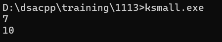

# DSA Question - 13/11/2024

### 1. Kth Smallest

Given an array **arr[]** of **N** distinct elements and a number **K,** where **K** is smaller than the size of the array. Find the **K’th** smallest element in the given array.

**Examples:**

> Input: arr[] = {7, 10, 4, 3, 20, 15}, K = 3 Output: 7Input: arr[] = {7, 10, 4, 3, 20, 15}, K = 4 Output: 10
> 

```jsx
#include <iostream>
#include <vector>
#include <algorithm>

using namespace std;

int sol(vector<int> arr, int k){
    sort(arr.begin(), arr.end());
    return arr[k-1];
}

int main(){
    cout << sol({7, 10, 4, 3, 20, 15}, 3) << endl;
    cout << sol({7, 10, 4, 3, 20, 15}, 4) << endl;
}
```



### Time Complexity

O(n log n)

### 2. Minimize Heights - II

Given an array **arr[]** denoting heights of **N** towers and a positive integer **K.**

For **each** tower, you must perform **exactly one** of the following operations **exactly once**.

- **Increase** the height of the tower by **K**
- **Decrease** the height of the tower by **K**

Find out the **minimum** possible difference between the height of the shortest and tallest towers after you have modified each tower.

You can find a slight modification of the problem [here](https://practice.geeksforgeeks.org/problems/minimize-the-heights-i/1/).**Note:** It is **compulsory** to increase or decrease the height by K for each tower. **After** the operation, the resultant array should **not** contain any **negative integers**.

**Examples :**

```
Input:k = 2, arr[] = {1, 5, 8, 10}
Output:5
Explanation:The array can be modified as {1+k, 5-k, 8-k, 10-k} = {3, 3, 6, 8}.The difference between the largest and the smallest is 8-3 = 5.

```

```
Input:k = 3, arr[] = {3, 9, 12, 16, 20}
Output:11
Explanation:The array can be modified as {3+k, 9+k, 12-k, 16-k, 20-k} -> {6, 12, 9, 13, 17}.The difference between the largest and the smallest is 17-6 = 11.

```

```jsx
#include <iostream>
#include <vector>
#include <algorithm>

using namespace std;

int sol(vector<int> arr, int k) {
    int n = arr.size();
    sort(arr.begin(), arr.end());
    int ans = arr[n - 1] - arr[0];
    int maxi, mini;

    for (int i = 1; i < n; i++) {
        if (arr[i] >= k) {
            maxi = max(arr[i - 1] + k, arr[n - 1] - k);
            mini = min(arr[0] + k, arr[i] - k);
            ans = min(ans, maxi - mini);
        }
    }
    return ans;
}

int main() {
    cout << sol({1, 5, 8, 10}, 2) << endl;
    cout << sol({3, 9, 12, 16, 20}, 3) << endl;
    return 0;
}

```


### Time Complexity

O(n log n)

### 3. Paranthesis Checker

Given a set of paranthesis, check whether they are balanced or not

```jsx
#include <iostream>
#include <vector>
#include <string>
#include <stack>

using namespace std;

bool isbalanced(string s){
	stack<char> st;
	st.push(s[0]);
	int i = 1;

	while (i < s.size()){
		if (s[i] == '('){
			st.push(s[i]);
		}else{
			if (st.empty() || st.top() != '(') {
                return false; 
            }
            st.pop();
		}
		i++;
	}
	return true;
}

int main(){
	vector<string> tc = {"((()))()()", "())((())"};
	for (string t : tc){
		if (isbalanced(t)){
			cout << "Balanced" << endl;
		}else{
			cout << "Not Balanced" << endl;
		}
	}
}

```


### Time Complexity

O(n)

### 4. Equilibrium Index of an array

Given an array **arr[]** of size **n**, return an equilibrium index (if any) or -1 if no equilibrium index exists. The **equilibrium index of an array** is an index such that the sum of elements at lower indexes equals the sum of elements at higher indexes.

**Note:** Return equilibrium point in 1-based indexing. Return -1 if no such point exists.

**Examples:**

> Input: arr[] = {-7, 1, 5, 2, -4, 3, 0} Output: 4 Explanation: In 1-based indexing, 4 is an equilibrium index, because: arr[1] + arr[2] + arr[3] = arr[5] + arr[6] + arr[7] Input: arr[] = {1, 2, 3} Output: -1 Explanation: There is no equilibrium index in the array.
> 

```jsx
#include <iostream>
#include <vector>

using namespace std;
 
int sol(vector<int> arr){
    int sumi = 0;
    for (int i : arr){
        sumi += i;
    }

    int sumi1 = 0;

    for (int i = 0; i< arr.size(); i++){
        sumi -= arr[i];
        if (sumi == sumi1){
            return i + 1;
        }
        sumi1 += arr[i];
    }
    return -1;
}

int main(){
    cout << sol({-7, 1, 5, 2, -4, 3, 0}) << endl;
    cout << sol({1, 2, 3}) << endl;
}
```


### Time Complexity

O(n)

### 5. Binary Search

Perform binary search on a sorted array

```jsx
#include <iostream>
#include <vector>  

using namespace std;

int sol(vector<int> arr, int target){
    int left = 0;
    int right = arr.size() - 1;

    while (left <= right){
        int mid = left + (right - left) / 2;
        if (arr[mid] == target){
            return mid;
        }
        else if (arr[mid] < target){
            left = mid + 1;
        }
        else{
            right = mid - 1;
        }
    }
    return -1;
}

int main(){
    cout << sol({1,2,3,4,5,6,7,8}, 2) << endl;
    cout << sol({2,5,7,9,10,30,67}, 12) << endl;
}
```


### Time Complexity

O(log n)