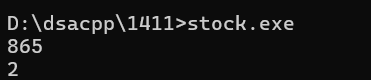

# DSA Question - 14/11/2024

### 1. Stock Buy and Sell

Given an array **prices[]** of size **n** denoting the cost of stock on each day, the task is to find the maximum total profit if we can buy and sell the stocks any number of times.

**Note:** We can only sell a stock which we have bought earlier and we cannot hold multiple stocks on any day.

**Examples:**

Input: prices[] = {100, 180, 260, 310, 40, 535, 695}

Output: 865

Explanation: 

Buy the stock on day 0 and sell it on day 3 => 310 – 100 = 210                       

Buy the stock on day 4 and sell it on day 6 => 695 – 40 = 655                      

 Maximum Profit  = 210 + 655 = 865

***Input:***

*prices[] = {4, 2, 2, 2, 4}*

***Output:***

*2*

***Explanation:***

*Buy the stock on day 3 and sell it on day 4 => 4 – 2 = 2*

*Maximum Profit  = 2*

```cpp
#include <iostream>
#include <vector>

using namespace std;

    int stock(vector<int> a, int n){
        int res = 0;
        
        for (int i = 1; i < n; i++){
            if (a[i] > a[i - 1]){
                res += a[i] - a[i - 1];
            }
        }
        return res;
    }

int main(){

    cout << stock({ 100, 180, 260, 310, 40, 535, 695 }, 7) << endl;

    cout << stock({4,2,2,2,4}, 5) << endl;
}
```



### Time Complexity

O(n)

### 2. Coin Exchange

Given an integer array of **coins[ ]** of size **N** representing different types of denominations and an integer **sum**, the task is to count all combinations of coins to make a given value **sum**.

**Note:** Assume that you have an infinite supply of each type of coin.

**Examples:**

***Input:** sum = 4, coins[] = {1,2,3}*

**Output:** 4

**Explanation:** there are four solutions: {1, 1, 1, 1}, {1, 1, 2}, {2, 2} and {1, 3}

***Input:** sum = 10, coins[] = {2, 5, 3, 6}*

**Output:** 5

**Explanation:** There are five solutions:

{2,2,2,2,2}, {2,2,3,3}, {2,2,6}, {2,3,5} and {5,5}

***Input:** sum = 10, coins[] = {10}*

**Output:** 1

**Explanation:** The only is to pick 1 coin of value 10.

***Input:** sum = 5, coins[] = {4}*

**Output:** 0

**Explanation:**  We cannot make sum 5 with the given coins

```cpp
#include <iostream>
#include <vector>

using namespace std;

int sol(vector<int> coins, int n, int sum){
    vector<int> dp(sum + 1, 0);
    dp[0] = 1;

    for (int i = 0; i < n; i++) {
        for (int j = coins[i]; j <= sum; j++) {
            dp[j] += dp[j - coins[i]];
        }
    }

    return dp[sum];
}

int main(){
    cout << sol({1,2,3}, 3, 4) << endl;
    cout << sol({2, 5, 3, 6}, 4, 10) << endl;
}
```


### Time Complexity

O(n * sum)

### 3. First and Last Occurence

Given a sorted array **arr[]** with possibly duplicate elements, the task is to find indexes of the first and last occurrences of an element **x** in the given array.

**Examples:**

***Input :** arr[] = {1, 3, 5, 5, 5, 5, 67, 123, 125}, x = 5**Output** : First Occurrence = 2              Last Occurrence = 5*

***Input :** arr[] = {1, 3, 5, 5, 5, 5, 7, 123, 125 }, x = 7*

***Output :** First Occurrence = 6*

Last Occurrence = 6

```cpp
#include <iostream>
#include <vector>

using namespace std;

int first(vector<int> arr, int n, int tar){
    int start = 0;
    int end = n - 1;
    int res = -1;

    while (start <= end){
        int mid = start + (end - start) / 2;

        if (arr[mid] == tar){
            res = mid;
            end = mid - 1;
        }
        else if (arr[mid] > tar){
            end = mid - 1;
        }
        else{
            start = mid + 1;
        }
    }
    return res;
}

int last(vector<int> arr, int n, int tar){
    int start = 0;
    int end = n - 1;
    int res = -1;

    while (start <= end){
        int mid = start + (end - start) / 2;

        if (arr[mid] == tar){
            res = mid;
            start = mid + 1;
        }
        else if (arr[mid] > tar){
            end = mid - 1;
        }
        else{
            start = mid + 1;
        }
    }
    return res;
}

void sol(vector<int> arr, int n, int tar){
    cout << first(arr, n, tar) << " ";
    cout << last(arr, n, tar) << endl;
}

int main(){
    sol({1, 3, 5, 5, 5, 5, 67, 123, 125}, 9, 5);	
    sol({1, 3, 5, 5, 5, 5, 7, 123, 125 }, 9, 7);
}

```


### Time Complexity

O(log n)

### 4. Transition Point

Given a **sorted array, arr[]** containing only **0s** and **1s**, find the **transition point**, i.e., the **first index** where **1** was observed, and **before that**, only 0 was observed.  If **arr** does not have any **1**, return **-1**. If array does not have any **0**, return **0**.

**Examples:**

```
Input:arr[] = [0, 0, 0, 1, 1]
Output: 3
Explanation: index 3 is the transition point where 1 begins.
```

```
Input:arr[] = [0, 0, 0, 0]
Output: -1
Explanation: Since, there is no "1", the answer is -1.

```

```
Input:arr[] = [1, 1, 1]
Output: 0
Explanation: There are no 0s in the array, so the transition point is 0, indicating that the first index (which contains 1) is also the first position of the array.
```

```
Input:arr[] = [0, 1, 1]
Output: 1
Explanation: Index 1 is the transition point where 1 starts, and before it, only 0 was observed.
```

```cpp
#include <iostream>
#include <vector>

using namespace std;

int sol(vector<int> arr, int n) {
    int low = 0, high = n - 1;
    
    while (low <= high) {
        int mid = low + (high - low) / 2;

        if (arr[mid] == 1) {
            if (mid == 0 || arr[mid - 1] == 0) {
                return mid;
            } else {
                high = mid - 1;
            }
        } else {
            low = mid + 1;
        }
    }
    
    return -1;
}

int main() {
    cout << sol({0, 0, 0, 1, 1}, 5 ) << endl;
    cout << sol({0, 0, 0, 0}, 4) << endl;   
    cout << sol({1, 1, 1}, 3) << endl;   
    cout << sol({0, 1, 1}, 3) << endl;   
    
    return 0;
}
```


### Time Complexity

O(log n)

### 5. First Repeating Element

Given an array **arr[],** find the first repeating element. The element should occur more than once and the index of its first occurrence should be the smallest.

**Note:-** The position you return should be according to 1-based indexing.

**Examples:**

```
Input:arr[] = [1, 5, 3, 4, 3, 5, 6]
Output: 2
Explanation:5 appears twice and its first appearance is at index 2 which is less than 3 whose first the occurring index is 3.
```

```
Input:arr[] = [1, 2, 3, 4]
Output: -1
Explanation:All elements appear only once so answer is -1.
```

```cpp
#include <iostream>
#include <vector>
#include <algorithm>

using namespace std;

int sol(vector<int> arr, int n) {
    int morethanone = -1;
    int index = -1;  // Store the index of the first duplicate element with the highest value
    vector<int> seen;

    for (int i = 0; i < n; i++) {
        if (find(seen.begin(), seen.end(), arr[i]) != seen.end()) {
            if (morethanone < arr[i]) {
                morethanone = arr[i];
                index = i;
            }
        }
        seen.push_back(arr[i]);
    }
    
    return index;
}

int main() {
    cout << sol({1, 5, 3, 4, 3, 5, 6}, 7) << endl;
    cout << sol({1, 2, 3, 4}, 4) << endl;
}

```


### Time Complexity

O(n)

### 6. Remove Duplicate Sorted Array

Given a sorted array **arr[]** of size **N**, the task is to remove the duplicate elements from the array. We need keep order of the remaining distinct elements as it was in the original array.

**Examples:**

***Input:** arr[] = {2, 2, 2, 2, 2}*

**Output:** arr[] = {2}

**Explanation:** All the elements are 2, So only keep one instance of 2.

***Input:** arr[] = {1, 2, 2, 3, 4, 4, 4, 5, 5}*

**Output:** arr[] = {1, 2, 3, 4, 5}

```cpp
#include <iostream>
#include <vector>

using namespace std;

vector<int> sol(vector<int> arr, int n){

    int i = 0; 
    for (int j = 1; j < arr.size(); j++) {
        if (arr[i] != arr[j]) { 
            i++; 
            arr[i] = arr[j];
        }
    }
    arr.resize(i + 1); 
    return arr;  
}

int main(){
    vector<int> res;

    res = sol({2, 2, 2, 2, 2}, 4);
    for (int i : res){
        cout << i << " ";
    }
    cout << endl;

    res = sol({1, 2, 2, 3, 4, 4, 4, 5, 5}, 9);
    for (int i : res){
        cout << i << " ";
    }
    cout << endl;

}
```


### Time Complexity

O(n)

### 7. Maximum Index

Given an array arr[] of N positive integers. The task is to find the maximum of j – i subjected to the constraint of arr[i] <= arr[j].

**Examples :**

```
Input: {34, 8, 10, 3, 2, 80, 30, 33, 1}
Output: 6  (j = 7, i = 1)

Input: {9, 2, 3, 4, 5, 6, 7, 8, 18, 0}
  Output: 8 ( j = 8, i = 0)
```

```cpp
#include <iostream>
#include <vector>

using namespace std;

int sol(const vector<int> arr, int n) {
    int dif = -1;
    int i, j;

    for (i = 0; i < n; ++i) {
        for (j = n - 1; j > i; --j) {
            if (arr[j] >= arr[i] && dif < (j - i)) {
                dif = j - i;
            }
        }
    }
    return dif;
}

int main() {

    cout << sol({34, 8, 10, 3, 2, 80, 30, 33, 1}, 9) << endl;
    cout << sol({9, 2, 3, 4, 5, 6, 7, 8, 18, 0}, 10) << endl;
}

```


### Time Complexity

O(n^2)

### 8. Wave Array

Given a **sorted** array **arr[]** of distinct integers. Sort the array into a wave-like array(In Place). In other words, arrange the elements into a sequence such that arr[1] >= arr[2] <= arr[3] >= arr[4] <= arr[5].....If there are multiple solutions, find the lexicographically smallest one.

**Note:** The given array is sorted in ascending order, and you don't need to return anything to change the original array.

**Examples:**

```
Input:arr[] = [1, 2, 3, 4, 5]
Output: [2, 1, 4, 3, 5]
Explanation:Array elements after sorting it in the waveform are 2, 1, 4, 3, 5.
```

```
Input:arr[] = [2, 4, 7, 8, 9, 10]
Output: [4, 2, 8, 7, 10, 9]
Explanation:Array elements after sorting it in the waveform are 4, 2, 8, 7, 10, 9.
```

```cpp
#include <iostream>
#include <vector>

using namespace std;

vector<int> sol(vector<int> arr, int n) {
    for (int i = 0; i < n; i += 2) {
        if (i > 0 && arr[i] < arr[i - 1]) {
            int temp = arr[i];
            arr[i] = arr[i - 1];
            arr[i - 1] = temp;
        }
        if (i + 1 < n && arr[i] < arr[i + 1]) {
            int temp = arr[i];
            arr[i] = arr[i + 1];
            arr[i + 1] = temp;
        }
    }
    return arr;
}

int main() {
    vector<int> res = sol({1, 2, 3, 4, 5}, 5);
    for (int i : res) {
        cout << i << " ";
    }
    cout << endl;

    res = sol({2, 4, 7, 8, 9, 10}, 6);
    for (int i : res) {
        cout << i << " ";
    }
    cout << endl;
}

```


### Time Complexity

O(n)